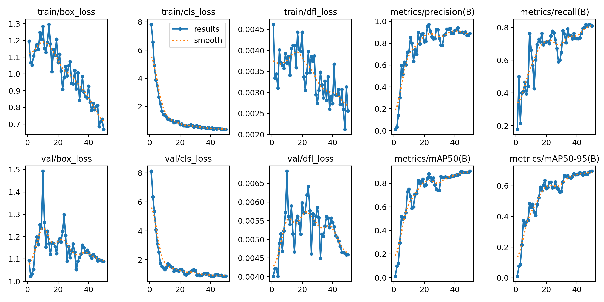

# Detección de Cascos de Obra – Rol x Color
---
Prototipo de Computer Vision para detectar colores de cascos de seguridad en obras de construcción utilizando YOLOv26, con el objetivo de identificar roles dentro de la obra.

---

## 📌 Problema AECO

En obras de construcción, el color del casco identifica el **rol** de cada trabajador. Identificar automáticamente qué roles están presentes en una imagen permite mejorar el monitoreo de seguridad, verificar la presencia de supervisores y detectar accesos no autorizados.

**Criterios de éxito:**
- mAP50 ≥ 0.70 sobre el conjunto de validación.
- Detección de las 5 clases de casco en condiciones variables de iluminación y distancia.
- Pipeline reproducible 100% en la nube (Google Colab), sin instalaciones locales.

---

## 🏷️ Clases y Reglas de Etiquetado

| Clase | Color | Rol típico en obra |
|---|---|---|
| `white_helmet` | Blanco | Ingeniero / Director de obra / Visita |
| `yellow_helmet` | Amarillo | Operario general / Construcción |
| `green_helmet` | Verde | Inspector de seguridad / HSE |
| `blue_helmet` | Azul | Supervisor / Capataz |
| `red_helmet` | Rojo | Electricista / Peligro especial |

**Reglas de etiquetado:**
- Se etiqueta el casco completo (bounding box ajustado, sin exceso de fondo).
- Se ignoran cascos parcialmente visibles (<30% visible).
- Imágenes obtenidas de [Unsplash](https://unsplash.com).

---

## 📦 Dataset

- Fuente: Roboflow — dataset propio etiquetado manualmente
- Enlace:

```python
!pip install roboflow

from roboflow import Roboflow
rf = Roboflow(api_key="g0oBodyeNNOa3ClBHPVn")
project = rf.workspace("jonathans-workspace-lsuhr").project("m4t3-helmet-role-detection")
version = project.version(1)
dataset = version.download("yolo26")
```
                
- Split: 70% entrenamiento / 20% validación / 10% test
- Formato de exportación: YOLO26
- Total de imágenes: 150

---

## 🚀 Cómo Reproducir (Google Colab)

1. Abrí el notebook desde GitHub:

   [](https://colab.research.google.com/github/dalingerj/deteccion-cascos-seguridad-obra-yolo26/blob/main/notebooks/deteccion-cascos-seguridad-obra-yolo26.ipynb)

2. Ejecutá en orden:
   - Celda 1 (Setup): Instalación de dependencias (ultralytics, roboflow)
   - Celda 2 (Fine-tune YOLO26 on custom dataset): Descarga del dataset desde Roboflow
   - Celda 3 (Custom Training): Entrenamiento YOLO26 (50 épocas) y métricas
   - Celda 4 (Validate fine-tuned model): Evaluación del modelo best.pt obtenido y métricas
   - Celda 5 (Inference with custom model): Inferencia de imágenes proporcionadas por el usuario
   
     *Cargar conjunto de imagenes personalizadas en:*
   
   ```python
   /content/datasets/m4t3-helmet-role-detection-1/test_random_img/images
   ```
3. Salidas esperadas:

    | Métrica | Valor Aproximado |
    |---|---|
    | Precision (P) | ~0.92 |
    | Recall (R) | ~0.80 |
    | mAP50 | ~0.85 |

 Observaciones clave - Matriz de confusión
  - **white_helmet** y **yellow_helmet** son las clases mejor detectadas.
  - **green_helmet** es la clase con menor cantidad de detecciones correctas, probablemente por poca representación en el dataset.
  - Se observan errores de prediccion de cascos blancos, amarillos y azules identificados como **background** (falsos negativos), lo que sugiere que algunos cascos en contextos complejos no son detectados correctamente.

---

## ✅ Checklist de Reproducibilidad

  - Dataset
  ```python
  !pip install roboflow
  
  from roboflow import Roboflow
  rf = Roboflow(api_key="g0oBodyeNNOa3ClBHPVn")
  project = rf.workspace("jonathans-workspace-lsuhr").project("m4t3-helmet-role-detection")
  version = project.version(1)
  dataset = version.download("yolo26")
  ```
  - Variante del modelo: yolo26m.pt
  - Epochs: 50 
  - Batch: 16
  - imgsz: 640
  - Ultralytics: 8.4.22

---

### 🔁 Prueba de Reproducibilidad

| Campo | Detalle |
|---|---|
| Última ejecución exitosa | _3/15/2026 - 1:00AM_ |
| GPU usada | NVIDIA T4 (Google Colab) |
| Tiempo estimadO de ejecucion | ~5-7 min con GPU T4 |



---

### 🔗 Archivo best.pt

[best.pt](https://drive.google.com/drive/folders/1jk-Nu9z-Mfewut5IRE0tbb82enFlDtD4?usp=sharing)
